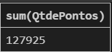
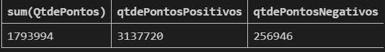

# Agregações
Referem-se ao processo de aplicar funções que operam em um conjunto de valores(linhas) e retornam um **único valor de resumo**

Essas funções são essenciais para análise de dados, pois permitem obter estatísticas e resumos de grandes quantidades de informações.

## As funções de agregação mais comuns em SQL são:

### COUNT()
Função: conta o número de linhas em uma tabela ou o número de valores não nulos em uma coluna.

Ex: Se quisermos saber o tamanho da tabela em número de linhas.

**O que o count está fazendo?** - ele está verificando linha por linha para verificar se não é null.

### SUM() 
Função: Calcula a soma dos valores de uma coluna

Exemplo01: Quero saber quantos pontos foram ganhos em julho.

Se não colocarmos o AND QtdePontos > 0, ocorre também a subtração.

Exemplo02: Extrato
Quero saber quanto de saldo tenho no mês
Quanto entrou
Quanto saiu

### AVG()
Função: calcula a média dos valores em uma coluna numérica

Exemplo: média do saldo dos clientes

Também é possível com SUM, caso queira a média inteira (pois estamos dividindo inteiro com inteiro)

### ROUND 
Utilizado para arredondar números

### MAX()
Função: Retorna o valor máximo em uma coluna.

Exemplo: ``SELECT MAX(Salario) FROM Funcionarios; ``(Encontra o salário mais alto)

### MIN()
Função: Retorna o valor mínimo em uma coluna.

Exemplo: ``SELECT MIN(DataPedido) FROM Pedidos; ``(Encontra a data do pedido mais antigo)

# DISTINCT

[DISTINCT](distinct/distinct.md)