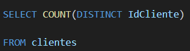
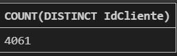
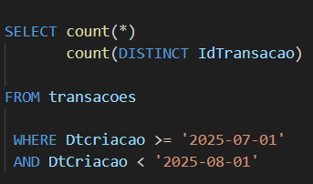

# DISTINCT

DISTINCT e as funções de agregação estão ligadas, mas tecnicamente eles servem para objetivos diferentes.

O **DISTINCT** em si não é uma função de agregação, mas sim um operador que atua na eliminação/ filtragem de linhas(de uma coluna) duplicadas.

Contexto01: Quero saber quantos clientes diferentes temos na tabela.

Ação do DISTINCT: Ele garante que, antes da contagem, quaisquer valores repetidos na coluna especificada(IdCliente) sejam considerados apenas única vez.

Contexto02: Quero saber a quantidade de transações que aconteceram em julho de 2025

obs: As duas formas de count estão corretas(qualquer uma dá certo)

**WHERE Dtcriacao >= '2025-07-01'**
**AND DtCriacao < '2025-08-01'**

Como é uma comparação lógica(<, > , >=, <=) ele não reconhece como data e sim como **string**( a diferença do outro exercício é que era para ENCONTRAR O DIA DA SEMANA e não para fazer uma comparação).

Ele entende que 2025-07-01 é menor que 2025-07-31 ( está ocorrendo uma comparação) é exatamente a mesma coisa que com letras(eduarda e aparecida) , se fosse para ordenar quem viria primeiro, aparecida e depois eduarda, isso acontece da mesma forma com datas.

`` count conta registros``
``distinct conta registros únicos ``