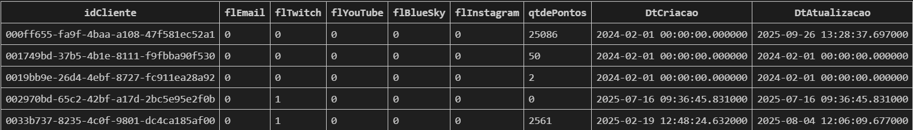
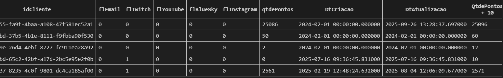
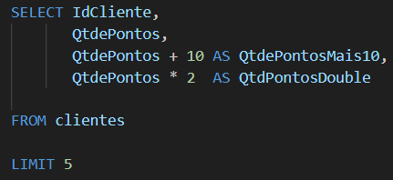
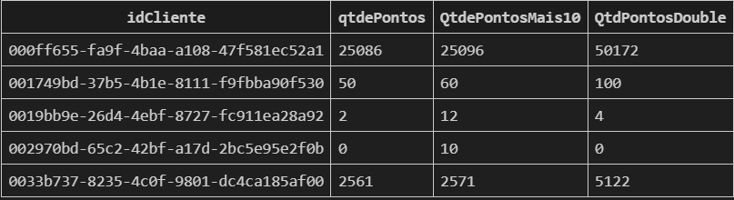

# Criação de colunas

Como criar colunas novas a partir de colunas que já existem.

Exemplo: Selecionar a tabela cliente e adicionar 10 pontos para cada usuário.

SELECT *, 
      QtdePontos + 10

FROM clientes

-- selecionando todas as colunas e adicionando uma a mais
**Antes**

**Depois**

`Isso é uma expressão QtdePontos + 10`

obs:**Essa expressõa não modifica os dados do banco principal**, a expressão só é exibida, mas não é armazenada permanentemente.

### Como renomear uma colunas (AS - apelido)

