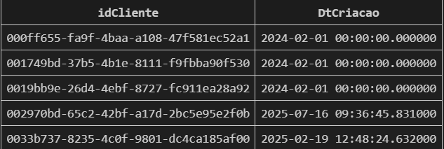
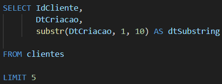
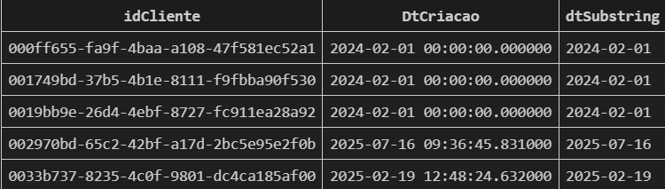
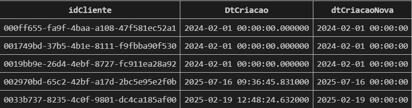
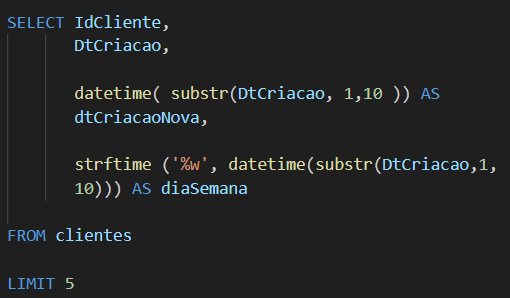
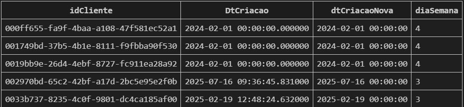

## Função Subtr
`É utilizada para pegar partes de STRING`
Exemplo: Queremos transformar DtCriacao em data

## Função datetime
Exemplo: Queremos descobrir o dia da semana dessa data(para isso precisamos transformar em datatime)

Temos a **função strftime**(format,time-value) que retorna a data formatada de acordo com a string de formato especificada como primeiro argumento

-- %d dia do mês - 01-31
-- %w dia da semana (0 = domingo)

Le-se `selecione` a coluna **IdCliente** e coluna **DtCriacao** e `crie uma coluna nova` chamada **dtSubstring** com essa expressão(pega a data de criação e selecione os 10 primeiros elementos). 

`Cria uma outra coluna` chamada **dtCriacaoNova** que é a substring do 10 elementos convertidos para datetime

 E por último `crie uma coluna` chamado **diaSemana** formatado para pegar apenas a semana daquela data

obs:trazemos para datetime pois é mais fácil fazer outras modificações e operações relacionadas a data

--  mesmo que substr e datetime de o mesmo resultado

link do site com as funções de SQLite:https://sqlite.org/lang_datefunc.html