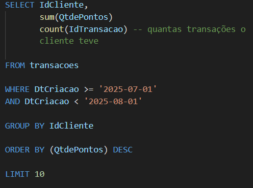
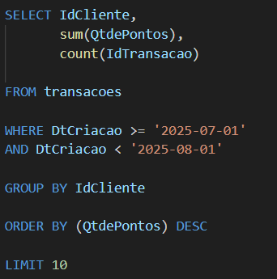
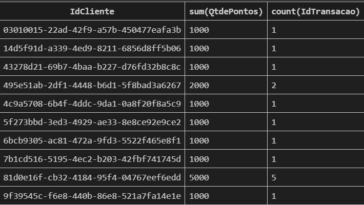

# GROUP BY

O ``GROUP BY `` não é uma função de agregação, mas sim uma cláusula que trabalha com as funções de agregação.

Propósito:Ele pega as linhas individuais e as organiza em grupos(de acordo com uma característica) para que você possa aplicar as funções de agregação a cada grupo individualmente.

``A cláusula GROUP BY permite que as funções de agregação passem de um resumo global para resumos por grupo.``

SELECT SUM(Vendas) FROM Pedidos;

	Retorna 1 linha com o total de vendas de todos os pedidos.

SELECT Regiao, SUM(Vendas) 

FROM Pedidos 

GROUP BY Regiao;	

Retorna várias linhas, onde cada linha tem o total de vendas para uma região específica.

Função de Agregação: Faz o cálculo (SUM, AVG, etc.).

Cláusula GROUP BY: Define as categorias (os "grupos") sobre as quais o cálculo será executado

Exemplo: Quero saber qual foi o cliente que juntou mais pontos no mês de julho

Esse código se lê:
- Selecione o IdCliente, somando os pontos deles, contando a quantidade de transações da tabela transacao

Filtrando apenas pela data de criação

grupando pelo cliente

e ordene pelo resultado

o limit é a última coisa sempre
