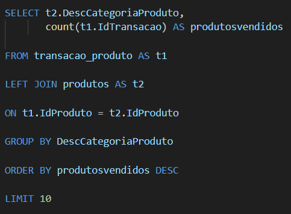
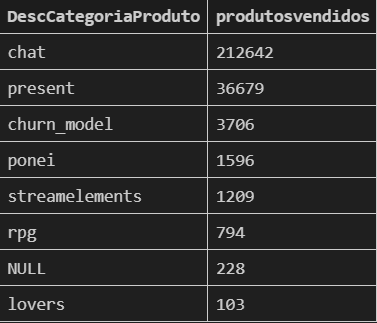

# JOIN (cruzamento de dados)
é uma cláusula que serve para combinar colunas de uma ou mais tabelas em um banco de dados relacional.

## Por que usar JOIN?
Em banco de dados relacionais, as informações são distribuídas em várias tabelas para evitar redundância, por exemplo:

 Qual categoria tem mais produtos vendidos?

Uma tabela `transacao_produto` com `idTransacaoProduto` , `IdProduto`, `QtdeProduto` e `vlProduto`.

Uma tabela `produtos` com `IdProduto`, `DescNomeProduto`, `DescDescricaoProduto	` e `DescCategoriaProduto`.

Queremos descobrir qual categoria vendeu mais produtos, para isso é preciso juntar as informações das duas tabelas, utilizando o JOIN, que relaciona as tabelas através da coluna em comum, que neste caso é o idProduto.

`Obs: A coluna em comum entre as duas tabelas não precisa ter o nome iguais e sim os valores.`

### Principais Tipos de JOIN

**LEFT** - Retorna todas as linhas da tabela da esquerda e as linhas correspondentes da tabela da direita. Se não houver correspondência na direita, os campos da direita vêm como `NULL`.

**RIGHT** - Retorna todas as linhas da tabela da direita e as linhas correspondentes da tabela da esquerda. Se não houver correspondência na esquerda, os campos da esquerda vêm como `NULL`.

**INNER JOIN (intercessão)** - Retorna apenas as linhas que têm valores iguais em ambas as tabelas. os valores que não iguais são "excluidos".