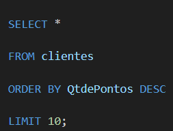
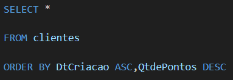
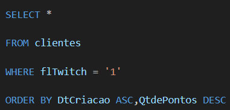
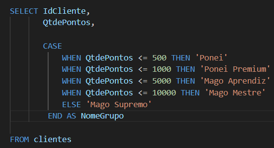
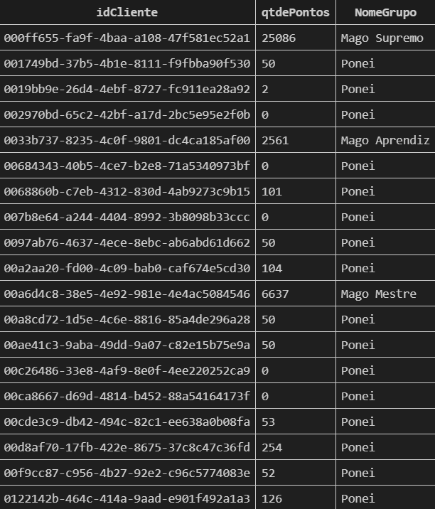
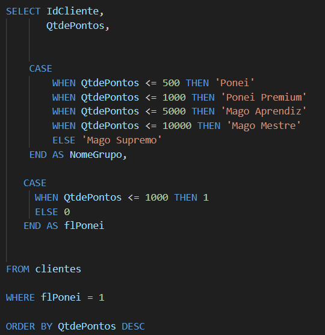
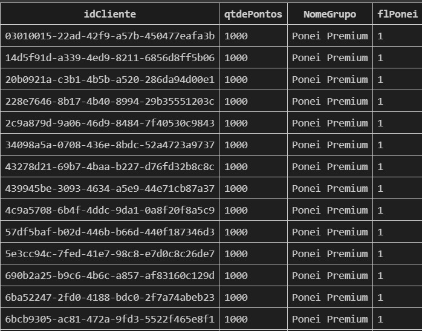

É o comando utilizado para ordenar as linhas da tabela.

Exemplo01: Filtrar os 10 primeiros clientes que tem mais pontos 

`ORDER BY automaticamente vem de forma crescente/ascendente ( do menor para o maior)`

Se quiser **decrescente** ( do maior para o menor) - comando **DESC**

Exemplo02: Ordenar os clientes dos mais antigos para os mais novos e caso tenha empate nas datas, ordenar os clientes que tenha mais pontos para os que tem menos pontos.

`obs: em data , para saber as datas mais antigas é Crescente-Ascendente( quanto menor ela é, mais antiga ela é também)`

Exemplo03: Ordenar os clientes dos mais antigos para os mais novos que são **inscritos na Twitch**( igual a 1) e caso tenha empate nas datas, ordenar os clientes que tenha mais pontos para os que tem menos pontos.

O WHERE entra aqui caso quisermos considerar apenas os clientes que tem twitch.

O WHEREe filtra antes de ordenar, `isso diminui muito o processamento de ficar ordenando`

**EXTRA** Por fim em cada código só pode existir um SELECT, FROM, WHERE, ORDER BY, mas dentro deles pode exister mais de uma coluna ou condições.

***
# CASE WHEN

Exemplo:
intervalos
 De 0 a 500 -> Ponei
de 501 a 1000 -> Ponei Premium
de 1001 a 5000 -> Mago Aprendiz
de 5001 a 10000 -> Mago Mestre
 +1001 -> Mago Supremo

 

 

 **UMA case gera UMA coluna**, mas as colunas que são condições podem ser mais de uma.

 o CASE sempre tem que estar entre o SELECT e o FROM pois o select seleciona coluna e o case cria colunas.  

 

 