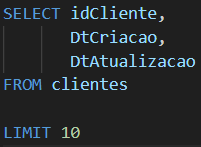

## SELECT 
É um comando utilizado para selecionar as colunas que quer consultar.
Mas toda consulta de tabelas precisa ao menos de duas instruções em sua sintaxe. A primeira é a SELECT, onde é passado uma lista de colunas que se deseja obter ou realizar a criação de novas colunas e cálculos.

Gera essa coluna

## FROM 
Esta é a segunda instrução necessária para realizar uma consulta simples. Devemos informar a partir de qual tabela desejamos obter os dados

Para selecionar **todas** colunas de uma tabela, utilizamos *(asterisco).

Caso queremos analisar colunas específicas, escrevemos o nome da coluna e se quisermos mais de uma coluna adicionamos uma vírgula(,)

LIMIT - limita quantas linhas queremos.
o comando LIMIT é sempre na última linha do código.

Resumo
SELECT
FROM **cliente**
Podemos ler esse código da seguinte forma:
"selecione todas colunas da tabela cliente"
***

## .tables
É o comando utilizado para dizer quantas tabelas tem no banco de dados que estamos usando.

obs: Esse comando varia de acordo com o banco de dados, por exemplo SHOW TABLES em MySQL.

### comentários 

obs: Não podemos comentar na última linha do código(normalmente depois do comando LIMIT), pois senão o código não roda.