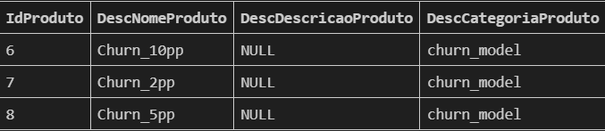
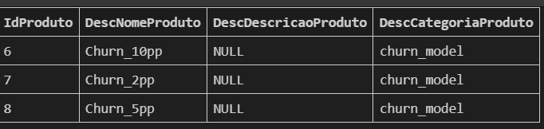

## WHERE
É o comando utilizado para realizar um filtro **em linhas**.

Podemos ler esse código da seguinte forma " selecione todas colunas da tabela cliente onde os valores da coluna Flemail sejam iguais a 1

obs: utilizamos aspas simples ' ', pois é uma STRING.

## OR, IN, LIKE (Comandos de filtrar)
Exemplo: Selecione produtos que contêm ‘churn’ no nome.

Na tabela temos 'churn_10pp'
                'churn_5pp'
                'churn_2pp'

Podemos começar filtrando com WHERE, mas ele se limita a comparar **apenas um valor**

WHERE DescNomeProduto = 'Churn_10pp'

obs: Se colocarmos WHERE DescNomeProduto = 'Churn_', não aparece nada.

### OR
É uma forma funcional de buscar múltiplos valores, mas se torna longa e menos legível à medida que a lista de valores aumenta.

**WHERE** DescNomeProduto = 'Churn_10pp'
**OR** DescNomeProduto = 'Churn_5pp'
**OR** DescNomeProduto = 'Churn_2pp'

Le-se `Onde` DescNomeProduto seja igual a **Churn_10pp** `OU` igual a **Churn_5pp**  `OU` ...

### Comando IN (lista de valores)

O comando IN é a forma preferida e mais limpa de substituir múltiplos ORs com o mesmo campo.

Where DescNomeProduto `IN` ('churn_10pp','churn_5pp', 'churn_2pp')

Le-se Onde DescNomeProduto esteja dentro dessa lista

### LIKE (tem que ser parecido com...)

WHERE DescNomeProduto `LIKE` **'Churn%'**

**Símbolo %**

palavra **%** - indica que a frase começa com essa palavras

%palavra - indica que a frase termina com essa palavras

%palavra % - indica que no meio do valor tem essa palavra

`% indica onde deve ocorrer a comparação.`
***
### MAS a melhor forma de escrever essa Query seria:

obs: Isso também depende de como os dados estão organizados, mas nesse contexto é possível escrever dessa forma:

WHERE DescCategoriaProduto = **'churn_model'**

 No final o menos custoso de processamento é o de igualdade(WHERE) mas cada uso depende de como o banco está organizado.

 ## Quando utilizar cada forma(desempenho)

 A desvantagem do LIKE é que ele é custoso, se você sabe o que quer buscar utiliza IN. No final o menos custoso de processamento é o de igualdade (WHERE)."